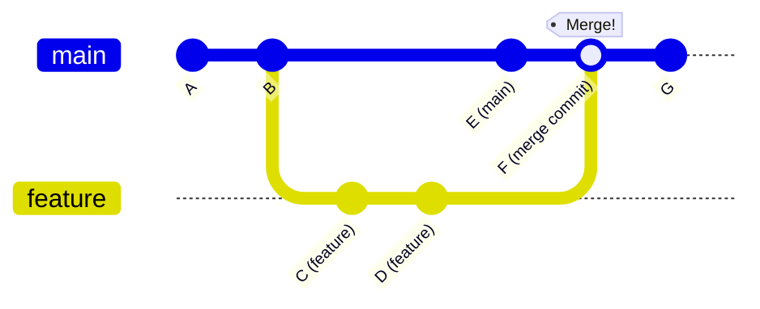
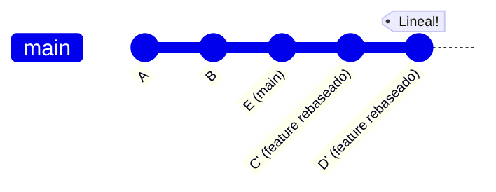
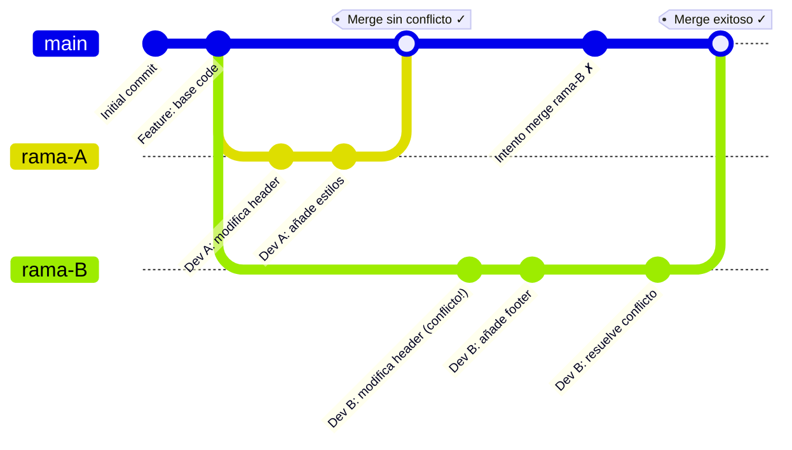

# Resolución de Conflictos en Git: Ejemplo Completo

## Introducción

Este documento es una guía práctica diseñada para estudiantes que están aprendiendo a trabajar en equipo con Git. El objetivo principal es **entender cómo y por qué surgen los conflictos** cuando varios desarrolladores modifican el mismo archivo, y más importante aún, **cómo resolverlos de manera efectiva**.

A lo largo de este tutorial encontrarás:
- Un **diagrama visual** que muestra el flujo completo del proceso
- Un **timeline realista** con horarios y pasos específicos que seguirían dos desarrolladores
- **Ejemplos de código** que muestran exactamente cómo se ve un conflicto y cómo resolverlo
- **Comandos prácticos** que necesitarás en situaciones reales

Este es un escenario muy común en el mundo profesional: dos desarrolladores trabajan en ramas diferentes, uno hace merge primero sin problemas, y el segundo debe resolver conflictos antes de poder integrar su código. ¡No te preocupes! Aunque parezca complicado al principio, resolver conflictos es una habilidad fundamental que dominarás con práctica.

## Conceptos Fundamentales: Merge vs Rebase

Antes de ver el ejemplo completo, es importante entender las dos formas principales de integrar cambios en Git: **merge** y **rebase**. Ambas sirven para combinar ramas, pero lo hacen de manera diferente.

### Git Merge

**¿Qué es?**

`git merge` combina los cambios de dos ramas creando un **nuevo commit de merge**. Es como unir dos caminos que se separaron, manteniendo el historial de ambos.

**¿Cómo funciona?**

Cuando haces merge, Git:
1. Encuentra el commit común más reciente entre ambas ramas (el "ancestro común")
2. Compara los cambios de ambas ramas desde ese punto
3. Combina los cambios y crea un nuevo commit que tiene dos "padres"

**Ventajas:**
- Mantiene el historial completo y verdadero de cómo se desarrolló el proyecto
- Es más seguro y fácil de entender para principiantes
- Los conflictos se resuelven una sola vez

**Ejemplo visual de merge:**



**Ejemplo práctico:**

```bash
# Estás en tu rama feature
git checkout feature

# Quieres traer los cambios de main a tu rama
git merge main

# Git crea un commit de merge automáticamente
# Si hay conflictos, los resuelves y haces:
git add .
git commit -m "Merge main into feature"
```

**Resultado del historial:**
```
* F - Merge main into feature (tiene 2 padres: D y E)
|\  
| * E - Cambios en main
* | D - Tu feature
* | C - Tu feature
|/  
* B - Base común
* A - Inicio
```

### Git Rebase

**¿Qué es?**

`git rebase` "reescribe" el historial moviendo tus commits para que parezca que empezaste tu trabajo desde el último commit de la otra rama. Es como decir: "quiero que mis cambios estén *después* de los cambios de main".

**¿Cómo funciona?**

Cuando haces rebase, Git:
1. Guarda temporalmente tus commits
2. Actualiza tu rama al último commit de la rama base
3. Aplica tus commits uno por uno encima

**Ventajas:**
- Historial lineal y más limpio (sin commits de merge)
- Más fácil de leer y seguir
- Profesional para proyectos open source

**Desventajas:**
- Reescribe el historial (puede ser peligroso en ramas compartidas)
- Si hay conflictos, debes resolverlos commit por commit
- Requiere más experiencia

**Ejemplo visual de rebase:**



**Ejemplo práctico:**

```bash
# Estás en tu rama feature
git checkout feature

# Quieres "mover" tus commits después de los de main
git rebase main

# Git aplica tus commits uno por uno
# Si hay conflictos en algún commit:
# 1. Resuelves el conflicto
git add .
# 2. Continúas el rebase
git rebase --continue

# Si quieres cancelar todo:
git rebase --abort
```

**Resultado del historial:**
```
* D' - Tu feature (reescrito)
* C' - Tu feature (reescrito)
* E - Cambios en main
* B - Base común
* A - Inicio
```

Nota cómo C' y D' son "nuevos" commits (tienen diferente ID) aunque tengan el mismo contenido que C y D.

### ¿Cuándo usar cada uno?

| Situación | Usar |
|-----------|------|
| Eres principiante | **Merge** |
| Trabajas en equipo en una rama compartida | **Merge** |
| Quieres mantener historial completo | **Merge** |
| Trabajas solo en tu rama | **Rebase** |
| Quieres historial limpio antes de hacer PR | **Rebase** |
| Proyecto open source con lineamientos estrictos | **Rebase** |

**Regla de oro**: ¡**NUNCA** hagas rebase de commits que ya has compartido (pushed) a una rama pública donde otros trabajan!

## Diagrama del Flujo de Trabajo



## Timeline Realista

### Día 1 - Lunes (Mañana)
**09:00** - Ambos desarrolladores empiezan a trabajar

**Desarrollador A:**
```bash
git checkout -b rama-A
# Trabaja en el archivo index.html
```

**Desarrollador B:**
```bash
git checkout -b rama-B
# Trabaja en el mismo archivo index.html (¡sin saberlo!)
```

### Día 1 - Lunes (Tarde)
**16:00** - Desarrollador A termina primero

```bash
# Desarrollador A en rama-A
git add .
git commit -m "feat: actualiza el header con nuevo logo"
git push origin rama-A
```

**16:30** - Desarrollador A crea Pull Request y es aprobado

```bash
# En GitHub/GitLab: Merge rama-A → main
# El main ahora tiene los cambios de A
```

### Día 2 - Martes (Mañana)
**10:00** - Desarrollador B termina su trabajo

```bash
# Desarrollador B en rama-B
git add .
git commit -m "feat: mejora el header y añade footer"
git push origin rama-B
```

**10:15** - Desarrollador B crea Pull Request pero... ¡CONFLICTO! ⚠️

### Día 2 - Martes (Resolución)
**10:30** - Desarrollador B empieza a resolver el conflicto

```bash
# Paso 1: Actualizar main local
git checkout main
git pull origin main

# Paso 2: Volver a rama-B y hacer rebase/merge
git checkout rama-B
git merge main
# ¡Git detecta conflicto en index.html!
```

**10:35** - Git muestra el conflicto en `index.html`:

```html
<header>
<<<<<<< HEAD (rama-B)
    <h1>Mi Sitio Web - Versión 2.0</h1>
    
=======
    <h1>Mi Sitio Web Renovado</h1>
    
>>>>>>> main (rama-A)
</header>
```

**10:45** - Desarrollador B resuelve manualmente:

```html
<header>
    <h1>Mi Sitio Web Renovado - Versión 2.0</h1>
    
</header>
```

**10:50** - Completa el merge:

```bash
git add index.html
git commit -m "fix: resuelve conflicto de merge con rama-A"
git push origin rama-B
```

**11:00** - Pull Request se actualiza y ahora se puede mergear sin conflictos ✓

```bash
# En GitHub/GitLab: Merge rama-B → main
```

## Ejemplo Práctico Completo

### Estado Inicial: `index.html` en main

```html
<!DOCTYPE html>
<html>
<head>
    <title>Mi Sitio</title>
</head>
<body>
    <header>
        <h1>Mi Sitio Web</h1>
        
    </header>
    <main>
        <p>Contenido principal</p>
    </main>
</body>
</html>
```

### Cambios del Desarrollador A (rama-A)

```html
<header>
    <h1>Mi Sitio Web Renovado</h1>
    
</header>
```

### Cambios del Desarrollador B (rama-B)

```html
<header>
    <h1>Mi Sitio Web - Versión 2.0</h1>
    
</header>
<footer>
    <p>© 2025 Mi Empresa</p>
</footer>
```

### Archivo Final Después de Resolver Conflicto

```html
<!DOCTYPE html>
<html>
<head>
    <title>Mi Sitio</title>
</head>
<body>
    <header>
        <!-- Combinación de ambos cambios -->
        <h1>Mi Sitio Web Renovado - Versión 2.0</h1>
        
    </header>
    <main>
        <p>Contenido principal</p>
    </main>
    <footer>
        <!-- Footer de Desarrollador B se mantiene -->
        <p>© 2025 Mi Empresa</p>
    </footer>
</body>
</html>
```

## Comandos Clave para Resolver Conflictos

```bash
# 1. Ver el estado del conflicto
git status

# 2. Ver los archivos en conflicto
git diff

# 3. Después de resolver manualmente
git add archivo-resuelto.html

# 4. Continuar el merge
git commit -m "fix: resuelve conflicto"

# 5. Si quieres abortar el merge
git merge --abort

# 6. Ver quién hizo qué cambios
git log --oneline --graph --all
```

## Resumen del Timeline

| Tiempo | Acción |
|--------|--------|
| **2-3 horas** | Desarrollo en ramas paralelas |
| **15 min** | Primer merge (sin conflicto) |
| **30-45 min** | Detectar + resolver conflicto |
| **Total: ~3-4 horas** | Para todo el proceso |

## Tips para Evitar Conflictos

1. **Comunicación**: Los devs deben avisar en qué archivos trabajan
2. **Pull frecuente**: Actualizar `main` cada mañana
3. **Ramas pequeñas**: Mergear rápido, no acumular cambios
4. **Revisar antes de push**: `git pull origin main` antes de hacer PR

## Recursos Adicionales

- [Documentación oficial de Git sobre merge](https://git-scm.com/docs/git-merge)
- [Atlassian: Tutorial de resolución de conflictos](https://www.atlassian.com/git/tutorials/using-branches/merge-conflicts)
- [GitHub: Resolver conflictos](https://docs.github.com/es/pull-requests/collaborating-with-pull-requests/addressing-merge-conflicts)
